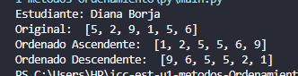
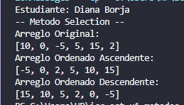
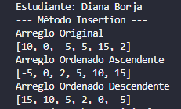
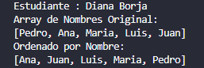
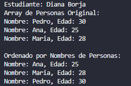
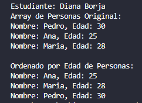

# Estructura de Datos

**Estudiante :** Diana Borja

## Métodos Ordenamiento

### Práctica 1 - 20/OCT
Metodo Sort Bubble

### Práctica 2 - 21/OCT
Método Sort Selection en Java y Python

## Práctica 3 - 23/OCT
Método Sort Insertion en Java

## Resultado de Salida de Python 

## Resultado de Salida de Java
 

## 1. Arreglo de números enteros

## 2. Arreglo de cadenas (nombres)

## 3. Arreglo de personas ordenado por nombre 

## 4. Arreglo de personas ordenadas por edad 

